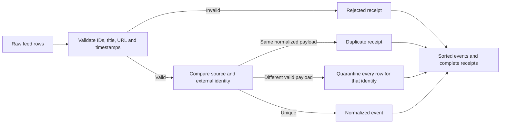

# Fitness event data pipeline — a Swift teaching example

Robin Winters · native iOS, applied AI and fitness technology · [robin.ac](https://robin.ac/)

A small, dependency-free Swift package showing how an event feed can become inspectable product data. It validates explicit timestamps, preserves source identity, deduplicates retransmissions and quarantines conflicting payloads. A command-line executable makes the transformation reproducible without an application or cloud account.

This is a standalone educational example prepared with coding-assistant support. It is **not ShowFlex source**, a released ShowFlex feature, a customer deployment, a scraped event calendar or an independently verified performance result. Every supplied event is synthetic, and example.org URLs are placeholders. The [professional record](https://github.com/RobinWinters/RobinWinters/tree/Radpository/professional) distinguishes approved work responsibilities from this teaching artifact.

## Run it

Requires Swift 6.0 or later. The package declares macOS 13/iOS 16 minimums; current execution checks are on macOS with Swift 6.4. iOS-device and Linux execution are not claimed.

```sh
swift test
swift run normalize-events < Fixtures/synthetic-events.json
```

Input is a JSON array matching `RawEvent`. Output has `events`, sorted by stable ID, and one receipt per input row. Invalid JSON causes a nonzero exit rather than silently producing an empty successful report.

Verified on October 2, 2026: all 12 tests passed on macOS with Swift 6.4. The command-line fixture produced one accepted event and five receipts; malformed JSON exited with status 1 and no successful output. See [verification.json](verification.json) and [expected fixture output](Fixtures/expected-output.json).



## Decisions made explicit

- **Identity:** feed ID plus provider ID, separated by a colon. Source slugs are normalized to lowercase; provider IDs remain case-sensitive. IDs cannot contain the separator, and events are never merged by title alone.
- **Dates:** input must supply a full timestamp with seconds and an explicit UTC offset. Output uses UTC. Missing end time stays unknown. Date-only/all-day events, named timezones, fractional seconds and recurrence require a separate policy; this example rejects unsupported timestamp forms.
- **Duplicate:** the normalized payload matches every field of the accepted event. Whitespace and equivalent timezone representations can normalize to the same payload.
- **Conflict:** different valid payloads share an identity. None wins by input order; every related valid row receives a conflict receipt and that event stays out of accepted output.
- **Provenance:** the HTTPS source URL is retained, with embedded credentials/fragments rejected. A source URL is a retrieval pointer, not proof that a record is true.

This example favors explicit uncertainty over guessing a timezone, end time or conflict winner. A real ingestion service also needs authenticated provider agreements, snapshots, update/deletion semantics, observability and retry policy. No network requests, credentials, database or model inference occur in this package.

## Why this belongs in a portfolio

The example makes data contracts and failure handling easy to review. Those concerns connect native event discovery to applied engineering and fitness technology without disclosing private application code or recasting a target role as past employment. Test results describe this package only.

## API documentation

The [DocC catalog](Sources/FitnessEventDataPipeline/FitnessEventDataPipeline.docc/FitnessEventDataPipeline.md) links the public API to a [fixture walkthrough](Sources/FitnessEventDataPipeline/FitnessEventDataPipeline.docc/InspectingNormalization.md), explaining final receipts, conflict quarantine and provenance limits. It documents the teaching package rather than private product implementation.

The `.spi.yml` manifest requests documentation for the library target if Swift Package Index accepts and successfully builds this package. Submission is pending; hosted documentation and index inclusion are not claimed. The existing 0.1.0 tag remains unchanged.

[GitHub profile](https://github.com/RobinWinters) · [Codeberg profile](https://codeberg.org/RobinWinters) · [Professional work and evidence](https://github.com/RobinWinters/RobinWinters/tree/Radpository/professional)
